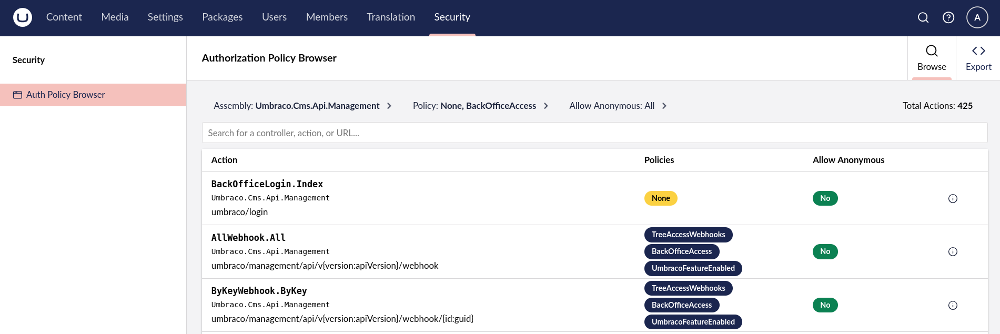
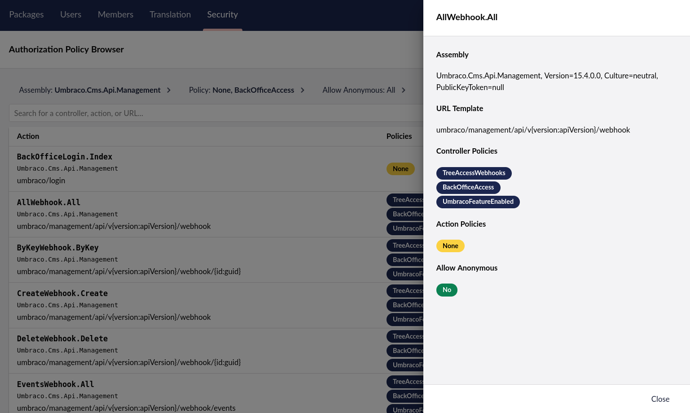

# Umbraco.Community.Security.AuthPolicyBrowser 

[](https://www.nuget.org/packages/Umbraco.Community.Security.AuthPolicyBrowser/)
[](https://www.nuget.org/packages/Umbraco.Community.Security.AuthPolicyBrowser)
[](../LICENSE)

A package from the [Umbraco Community Security and Privacy Team](https://community.umbraco.com/the-community-blog/security-privacy-team-presentation/)
to help Umbraco developers and security auditors find [broken access controls](https://owasp.org/Top10/A01_2021-Broken_Access_Control/)
in their applications.

## Installation

> [!NOTE]
> Umbraco v15+ is required to use this package.

Add to an existing Umbraco project using the .NET CLI:

```shell
dotnet add package Umbraco.Community.Security.AuthPolicyBrowser
```

## Features

Once installed, a new **Security** section will be added to the backoffice.

> [!NOTE]
> Backoffice users must be granted access to the section in order to
> see it.

The main dashboard allows users to browse the ASP.NET controller actions in the
application and the authorization policies applied to them:



More details about an action can be seen by clicking the info icon in the table:



## 👀 What to look for

Particular attention should be paid to any actions that might allow anonymous
requests (i.e., those with `[AllowAnonymous]` attributes), and those without any
policies at all. Of course, some actions are *supposed* to allow anonymous
requests, but if your API method is only meant to be called by users who are
logged into the backoffice (for example), then it should probably have some
policies in place.

The policies themselves should also be reviewed to ensure that they are
appropriate for the API/action method in question. For example, if your API
should only be called by users with access to the Umbraco Settings section,
then it should have the `SectionAccessSettings` policy applied.

It should be noted that this package currently only looks at the
[ASP.NET `[Authorize]` and `[AllowAnonymous]` attributes](https://learn.microsoft.com/en-us/aspnet/core/security/authorization/simple?view=aspnetcore-9.0)
and therefore will not account for any custom authorization logic that may
exist in an application. We'd be interested to know if there are other
attributes we should look at or any other information that would be useful to
show on the dashboard.

## ⚠️ If you find a security issue...

With this package you can see *all* actions across all assemblies that are
loaded at runtime, including the Umbraco core CMS and any third-party packages
you have installed. If you find any authorization issues in the core CMS or
packages, please disclose them responsibly following Umbraco's guidance on
[how to report a vulnerability](https://umbraco.com/trust-center/security-and-umbraco/how-to-report-a-vulnerability-in-umbraco/).

If this package has helped you to find issues in your own applications, we'd
love to hear about it!

## Contributing

Contributions to this package are most welcome via GitHub issues or pull requests.

We'd appreciate any feedback or contributions relating to:

- Security issues (bonus high fives if you find any, but please remember to disclose issues responsibly!)
- Accessibility issues
- Localization (there isn't much, if any)
- Code quality (this is my first package for the new Bellissima backoffice!)
- UI/UX improvements
- Anything else I've missed!

## Acknowledgments

Thanks to [Lotte Pitcher](https://github.com/LottePitcher) for the
[Opinionated Umbraco Package Starter Template](https://github.com/LottePitcher/opinionated-package-starter)
which was used as a starting point for this package.
